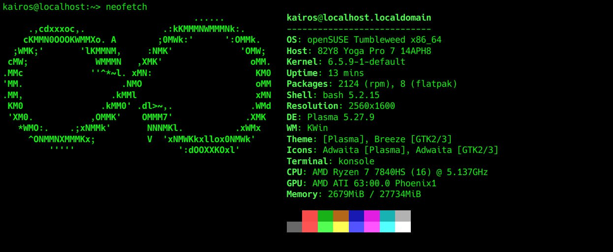
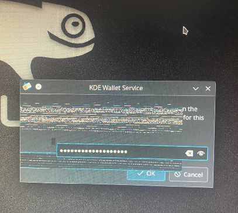
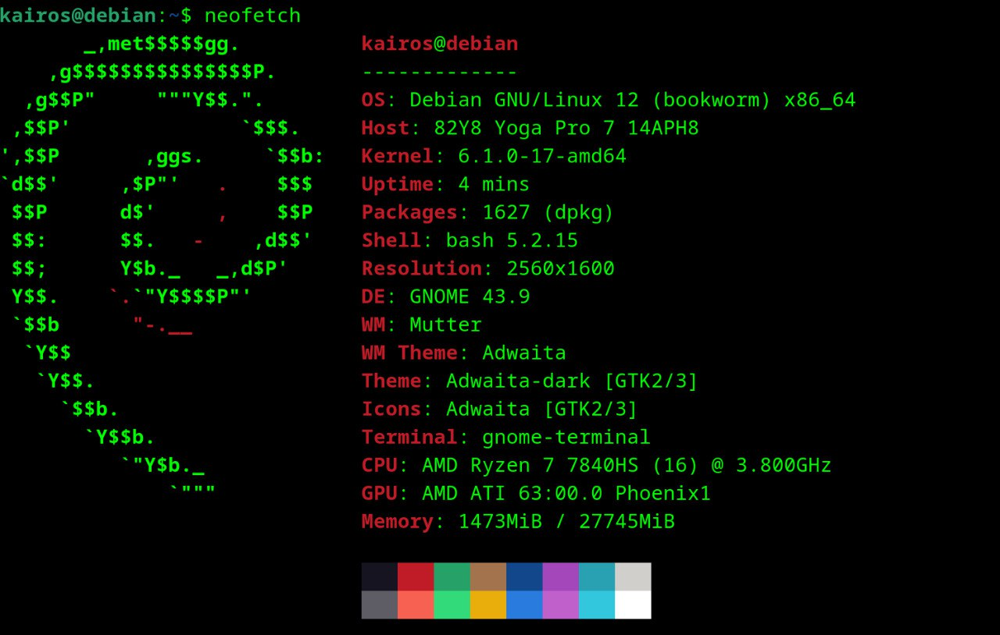
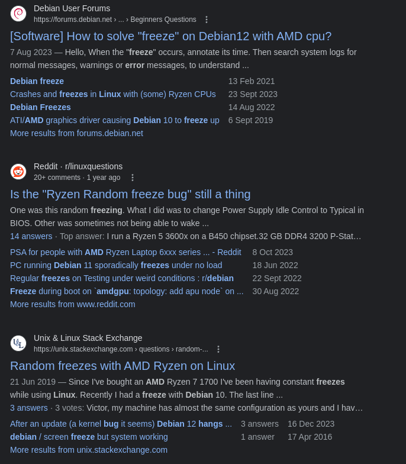
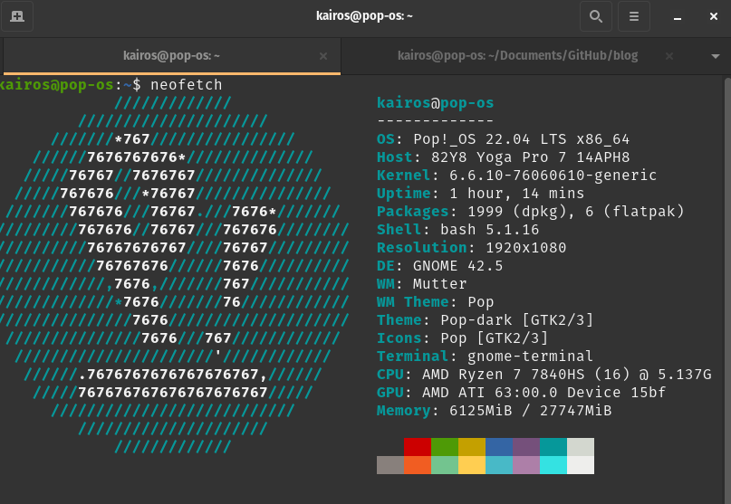
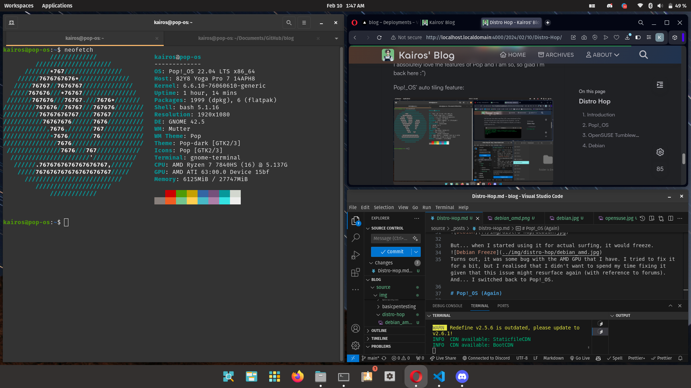

# Introduction

In 2023, I started to explore Linux (or GNU/Linux, if you will). Given that I started off with 'hacking', I used Kali Linux and Parrot Security. I realised the huge potential of Linux with its customisability, ease of installation of packages, and the command line which was so convenient. So, I decided to use Linux as my daily driver, exploring other distros.

# Pop!\_OS

My first ever host distro was Pop!\_OS. I was introduced to Pop by a few friends and I was amazed by the simplicity - yet the power - of the distro. Pop!\_OS is based on Ubuntu, so it was a good start for me. Unfortunately, this is the only screenshot I have of Pop!\_OS:

I think Pop was the longest distro I've ever used; I used it from Jul 2023 to Nov 2023 - that's almost 5 months. I never had major issues with Pop, its performance was great, and I loved the DE, which was a custom GNOME. The installation process was a little bit tricky and I made a mistake (not disabling secure boot), so I had to use reFind to boot between Windows and Pop rather than using the Systemd boot manager.

After I switched to a new laptop, I needed a distro that could support more novel hardware, so I switched to OpenSUSE Tumbleweed.

# OpenSUSE Tumbleweed

OpenSUSE Tumbleweed is a distro that is rolling release, meaning that it is always up-to-date. I used it till Feb 2024. OpenSUSE was pretty nice, and I used KDE as my DE.

It was really familiar, but its kryptonite was... constant breakage. I tried to update every day, and that came with a cost.

It had weird bugs, and it broke apps like Opera or VSCode, which was really a pain. I had to rollback a bunch of times or reinstall the apps (AND wiping their data; I guess it messed with the data files too).

I was tired of the constant breakage, incompatibility with some apps, and I wasn't the biggest fan of it's package manager, Zypper. So I decided to switch to a stable distro and one that uses APT.

# Debian

I used Debian for a very, very short while. Less than a day. Less than an hour even. I was really excited to use Debian — don't get me wrong — and to be fair, it was really nice with the GNOME DE + some extensions.

But... when I started using it for actual surfing, it would freeze.

Turns out, it was some bug with the AMD GPU that I have. I tried to fix it for a bit, but I realised that I didn't want to spend my time fixing it given that this issue might resurface again (with reference to forums). And... I switched back to Pop!\_OS.

# Pop!\_OS (Again)

I'm back to Pop!\_OS, and I'm really satisfied with it. For the months that I've been away, as funny as it sounds, I missed it a lot. I even used VMware to run Pop!\_OS on my OpenSUSE machine at one point 💀.

I absolutely love the features of Pop and I am so, so glad I'm back here :")

Pop!\_OS' auto tiling feature:

There are a lot of features that I love about Pop, and I'm really glad to be back. I'm not sure if I'll be hopping again (probably not for now), but I'm really satisfied with what I have now! :D
